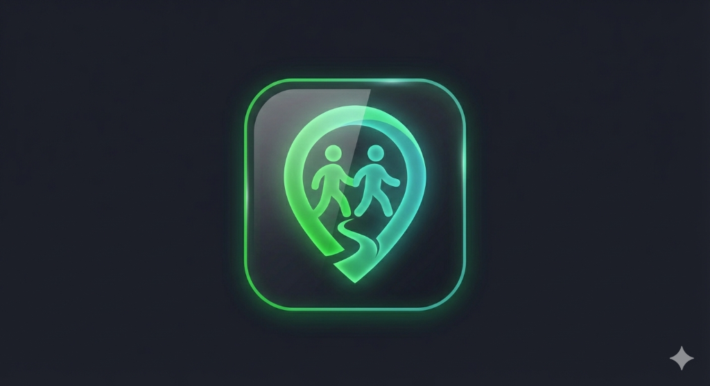

# GuzoMate 🚶‍♂️🤝

**GuzoMate** is a premium mobile application designed to connect people who want to walk together. Whether you're looking for a fitness partner, a safer commute, or just some company on your daily stroll, GuzoMate uses cutting-edge location technology to help you find the perfect walking buddy nearby.

<p align="center">
  
</p>

## ✨ Features

- **🎯 Smart Discovery**: Find walking buddies within your preferred radius using high-precision PostGIS geo-queries.
- **🎴 Swipe to Connect**: Tinder-style swipeable user cards with a beautiful mesh gradient aesthetic.
- **📍 Real-time Tracking**: Live map view showing active walkers and buddy locations.
- **💬 Instant Messaging**: Real-time chat integration once you've matched with a buddy.
- **🔒 Safety First**: Trusted contacts, SOS triggers, and location sharing controls.
- **⭐ GuzoMate+**: Premium features including expanded search radius, advanced filters, and more.

## 🛠 Tech Stack

- **Frontend**: Flutter & Dart
- **State Management**: Riverpod
- **Backend**: Supabase (PostgreSQL, PostGIS, Auth, Realtime)
- **Maps**: Google Maps Flutter SDK
- **Design**: Modern UI with custom mesh gradients and smooth animations.

## 🚀 Getting Started

### Prerequisites

- Flutter SDK (^3.9.2)
- Android Studio / VS Code
- A Supabase Project (PostGIS enabled)
- Google Maps API Key

### Installation

1. **Clone the repository**:
   ```bash
   git clone https://github.com/sudik2005/GuzoMate.git
   cd GuzoMate
   ```

2. **Install dependencies**:
   ```bash
   flutter pub get
   ```

3. **Configure environment**:
   - Create your Supabase project.
   - Deploy the required PostGIS functions (`get_nearby_walkers`, `upsert_active_walker`).
   - Add your Supabase credentials in the app configuration.

4. **Run the app**:
   ```bash
   flutter run
   ```

## 📦 Deployment

To build the release version for Android:
```bash
flutter build apk --release
```

The project is already configured with a release signing setup. Make sure you have your `key.properties` and keystore file ready (ignored by Git for safety).

## 📄 License

This project is shared for private use. See our internal documentation for licensing details.

---
Built with ❤️ by [sudik2005](https://github.com/sudik2005)
